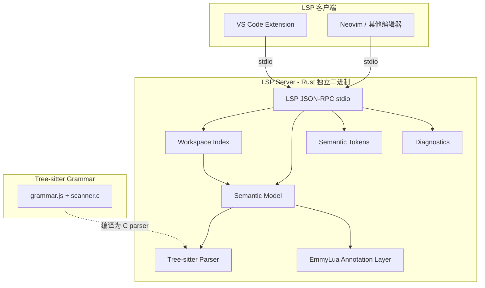

# 架构说明

本文档描述 **Mylua LSP** 的逻辑分层与核心子系统设计。

## 1. 制品与分工



| 子工程 | 职责 | 边界 |
|--------|------|------|
| **grammar/** | Tree-sitter 文法（Lua 5.3+ 语句 + EmmyLua 注释节点），输出一棵统一 AST | 仅管句法结构 |
| **lsp/** | 链接 parser，构建索引/语义/诊断，输出 LSP 响应 | 零 VS Code API |
| **vscode-extension/** | TextMate 基色 + LSP 客户端 + 配置 schema + 状态栏 | 不做语言理解 |

**关键约定**：Lua 代码与 EmmyLua 注解在同一 Tree-sitter 文法中描述，整文件产出一棵语法树。LSP 只消费这棵树，不维护并列句法。

## 2. 数据流

```
源文件 → tree-sitter parse → AST
  → summary_builder（提取全局贡献/类型定义/函数摘要/table shape）
  → scope_tree（作用域 + 局部变量）
  → aggregation（工作区聚合索引）
  → LSP handlers（goto/hover/references/completion/diagnostics/...）
```

- **TextMate** 负责编辑器基色（含 `---@…` 样式）
- **Semantic Tokens** 仅补充 TextMate 无法静态判定的语义类别（全局 `defaultLibrary`、全局 vs 局部、Emmy 类型名）
- **URI 边界**：LSP params 与文件扫描层接收/产生 `Uri`；进入 handler 后先 intern 为 `UriId`，`documents`、feature 逻辑、resolver 与诊断队列均以 `UriId` 作为文档身份。只有在构造 `Location`、`WorkspaceEdit`、`CallHierarchyItem`、诊断发布等协议输出时，才通过 URI registry 解析回 `Uri`。

## 3. 核心子系统

### 3.1 索引与冷启动

**索引状态机**：`Initializing` → `ModuleMapReady` → `Ready`

**冷启动流水线**（5 阶段）：
1. **scan** — 文件发现 + glob 过滤
2. **module_map** — 立即填充 `module_index`（`document_link` 可用）
3. **parse** — rayon 全量并行 tree-sitter parse + build_summary
4. **build_initial** — 原子一次性构建工作区聚合层
5. **Ready** — 全能力可用

**内存策略**：全工作区 `text + tree + scope_tree` 常驻内存，不做 LRU / 懒 parse。LSP 内部 `documents` 以进程级、只增不删的 `UriId` 为 key，跨文件功能通过全局 URI registry 在边界解析回原始 `Uri`。5 万文件级别峰值 RSS ~1.5–3GB。

**增量更新**：编辑期通过 `upsert_summary` 增量更新聚合索引，不必全库重建。

> 详见 [`index-architecture.md`](index-architecture.md)

### 3.2 作用域与模块解析

- **作用域**：遵守 Lua `local` / 块 / 闭包规则
- **全局模型**：工作区采用「全局已加载」合并模型，不把可见性绑死在 require 链上
- **require 解析**：`local xxx = require("…")` 静态解析为文件路径，绑定到目标文件 `return` 值
- **模块路径**：全路径小写 + `.` 分隔 + `init.lua` 特殊处理，last-segment 索引 + 最长后缀匹配

### 3.3 类型系统

- **Emmy 优先**：命中明确 Emmy 类型后完全切换到 Emmy 语义，不再混用 table shape
- **Table shape**：每个 table 字面值按节点 identity 建模，单文件内持续更新 shape
- **全局 table**：跨文件允许对同一全局路径做结构合并，保留逐段节点树与来源候选
- **定义位置**：resolver 内部的定义位置使用进程级 `UriId` + `ByteRange`；hover / goto / references / completion / signatureHelp 在构造 LSP 响应时再通过 URI registry 解析回 `Uri`

### 3.4 诊断

- **分层策略**：Emmy 路径严格（`error`），Lua 路径保守（高确定性才报）
- **调度**：`DiagnosticScheduler` 统一管理，300ms debounce，hot/cold 双优先级队列；队列内部使用进程级 `UriId`，在 LSP 发布边界再解析回 `Uri`
- **配置**：`mylua.diagnostics.scope`（`full` / `openOnly`）控制范围

**模块结构**（`src/diagnostics/`）：

| 文件 | 职责 |
|------|------|
| `mod.rs` | 入口函数 `collect_diagnostics` / `collect_semantic_diagnostics`，调度各子检查器 |
| `syntax.rs` | 语法错误收集（tree-sitter ERROR / MISSING 节点） |
| `undefined_global.rs` | 未定义全局变量检查 |
| `field_access.rs` | 字段访问检查（Emmy 类型 + Lua table shape） |
| `type_mismatch.rs` | 类型不匹配检查（`@type` 声明 vs 赋值） |
| `type_compat.rs` | 共享类型兼容性工具（`is_type_compatible`、字面量推断等） |
| `duplicate_key.rs` | 重复 table key 检查 |
| `unused_local.rs` | 未使用局部变量检查 |
| `call_args.rs` | 函数调用参数数量/类型检查 |
| `return_mismatch.rs` | `@return` 声明 vs 实际 return 语句检查 |
| `suppression.rs` | `---@diagnostic` 抑制指令系统 |

> 详见 [`lsp-capabilities.md`](lsp-capabilities.md)

### 3.5 外部库（workspace.library）

`mylua.workspace.library` 配置额外库目录，以同等方式参与索引。库文件强制 `is_meta = true`，享受诊断抑制。典型场景：Lua stdlib stubs、第三方注解包。

## 4. 并发与安全

- **per-URI `edit_locks`**，固定锁顺序：`edit_locks` → `open_uris` → `documents` → `index` → `scheduler.inner`
- **增量解析**：tree-sitter `tree.edit` + `parse(new, Some(old))`
- **可取消**：遵守 `$/cancelRequest`

## 5. 技术选型

| 组件 | 选型 | 理由 |
|------|------|------|
| LSP Server | Rust | 与 Tree-sitter C FFI 零开销互操作、单二进制分发 |
| VS Code Extension | TypeScript | 官方路径，子进程启动 LSP 二进制 |
| 解析器 | Tree-sitter（自研文法） | 增量解析、错误恢复、统一 AST |
| 异步运行时 | tokio | LSP 框架要求 |
