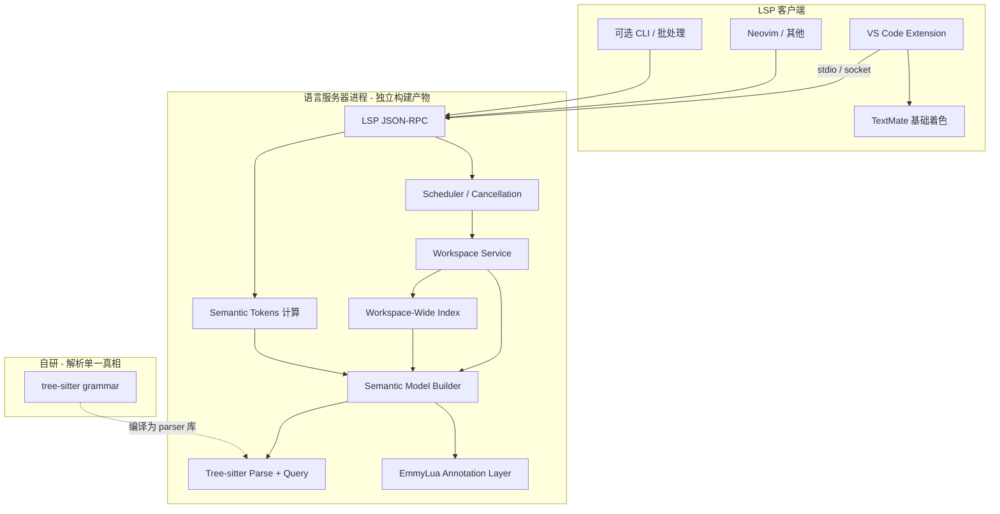

# 架构说明

本文档描述 **Mylua LSP** 的逻辑分层、**Extension 与 LSP 分离** 的制品关系，以及 **Tree-sitter 自研文法** 在系统中的位置。需求见 [`requirements.md`](requirements.md)；排期见 [`implementation-roadmap.md`](implementation-roadmap.md)。

**仓库**：源码采用 **Monorepo**（单仓），典型目录见 [`implementation-roadmap.md`](implementation-roadmap.md) §2；以下为逻辑制品，不等于强制单进程。

## 1. 制品与子工程划分

| 子工程 | 职责 |
|--------|------|
| **Tree-sitter Grammar** | **自研** `tree-sitter-*` 文法（Lua 5.3+ + EmmyLua 注释结构 + 将来方言扩展点）；**仅供 LSP 内解析**；版本与 **LSP** 锁定同步。 |
| **TextMate Grammar** | **自研**（扩展侧）：**基础语法高亮**；与 §Lua/Emmy 展示边界与文档约定对齐，避免与解析语义长期脱节。 |
| **LSP Server** | 链接 Tree-sitter parser；构建语法树查询层、**全工作区索引**、语义与诊断；输出 **semantic tokens**；**零 VS Code API**。 |
| **VS Code Extension** | `contributes.grammars`（TextMate）、semantic token **作用域默认映射**、配置 schema；拉起/重连 LSP；可选命令与状态栏。**不要求**在扩展进程内再跑一套 Tree-sitter 仅服务于基色高亮。 |

### 1.1 Lua 与 EmmyLua：同一文件里的两层，与三子工程分工

**是否在语法上与 Lua「融合」？——分层次看：**

- **运行时**：Lua 只执行代码。EmmyLua 标注写在 **注释**（通常 `---` 文档/语义注释）里，**不参与**可执行语法；不是「在 Lua 词法里新增一批 Emmy 关键字」那种运行时融合。
- **单文件模型**：对用户仍是一个 `.lua` 文件，同时含 **语句/表达式** 与 **注释里的结构化标注**。工程上把它看成 **同一语言表面** 的两部分：前者走 Lua 产生式；后者可在 **同一 Tree-sitter 文法** 里用「注释内容」子规则显式拆成节点（与是否在 Lua 官方文法里「一体」无关——**树里一体即可**）。
- **`grammar/`**：**结构单一真相**。Lua 5.3+ 与「注释内的 `@class` / `@param` / …」在同仓库文法中描述，整文件进 **一棵语法树**（Lua 与 Emmy 片段在树中邻接或父子嵌套）。LSP **只消费这棵树**，不在别处再维护一套并列句法。
- **`vscode-extension/`**：**无 Emmy AST**。TextMate 只做 **基色**（含对 `---@…` 的样式）；与 Tree-sitter **共享同一份边界/约定**（见 [`requirements.md`](requirements.md) §3.1），用测试夹具防止「肉眼看是一种划分、树里是另一种」长期脱节。
- **`lsp/`**：在 Tree-sitter 树上建 **注解层（ANN）**：把 Emmy 节点 **绑定** 到邻近符号，做类型近似、跳转、Hover、诊断等；**语义真相**在此。

**小结**：三块不是把同一种东西拆成三份各写各的：**`grammar` 管句法结构（含注释内 Emmy 形状）、`vscode-extension` 管编辑器里怎么上色、`lsp` 管绑定与语义**。若 Emmy 只当「纯文本注释」不解析，也能做粗版产品，但与「注释内显式节点化、与 Lua 同树」的路线不一致——本项目需求已偏向 **同树 + ANN**，见 [`requirements.md`](requirements.md) §3.6。

**并行开发**：扩展与服务器接口契约为 **LSP + 配置 schema + grammar 版本号**，源码 **Monorepo 邻接**（本地可先 `cargo build` / 脚本产出 `lsp` 二进制再由扩展 `spawn`）；对外发布时仍可 **分别打包**（VSIX、GitHub Release 等），制品版本与仓库 tag 对齐。

## 2. 总体数据流（逻辑）

- **扩展** 负责 **TextMate 基色** 与 LSP 宿主；**所有**「这句话定义在哪、全库谁引用」与 **semantic tokens** 均在 **LSP** 内完成。
- **Tree-sitter** 仅在 LSP 内承担 **增量解析、AST 查询**；语义层在语法树之上做 **作用域、模块图、类型近似**；再映射为 **semantic highlighting**。

## 3. 核心子系统

### 3.1 Tree-sitter（解析）与 TextMate（基色）

- **Tree-sitter 文法**：在己方仓库中维护；升级 Lua 子集或定制语法时 **先改 Tree-sitter 文法、再生 parser、再调语义与 token 规则**。
- **TextMate**：单独维护，与 **同一套语言边界说明**（Lua 5.3+、注释/Emmy 展示）对齐；**不负责**替代语法树。
- **一致性**：诊断/跳转以 **Tree-sitter AST** 为准；屏幕上「第一眼颜色」以 **TextMate** 为准，**semantic tokens** 只在其上叠加少量语义区分（全局 `defaultLibrary`、全局/局部、Emmy 类型名），**不作**另一套独立高亮系统；产品侧用测试与文档避免二者**长期**割裂。
- **查询层**：大纲、索引、rename 等可基于 `tree-sitter query` 或等价遍历；**EmmyLua** 在 Tree-sitter 中 **显式节点化**；TextMate 可对注释块做 **粗粒度** 着色配合。

### 3.2 工作区级索引（workspace-wide 必备）

- **文件发现**：`.gitignore`、用户 exclude、globs；支持 5 万级路径。
- **符号与引用索引**：为 **definition / references / workspace/symbol** 维护可增量更新的结构（例如 **工作区全局符号合并表**、`local = require` **绑定边**、引用发生列表）；**不**依赖「未 require 则不可见」的模块隔离模型，见 §3.4。
- **AST 驻留策略**：**全工作区 `text + tree + scope_tree` 常驻内存，不做 LRU / 懒 parse**（设计契约，见 [`performance-analysis.md`](performance-analysis.md) §3.1）。理由：goto / hover / references / 级联诊断都需要任意文件的语法树，驱逐未打开文件会导致首次跨文件跳转触发 on-demand parse 的可感知卡顿。代价是 5 万文件级别峰值 RSS ~1.5–3GB、冷启动必须全量 parse 一遍（`tree_sitter::Tree` 不可序列化）；冷启动已完全后台化（4 阶段流水线：scan → rayon 全量并行 parse → 原子 `build_initial` → Ready），用户侧不存在"等 Ready"的阻塞窗口。**查询语义**覆盖全工作区，与 [`requirements.md`](requirements.md) 一致。
- **监听与批量变更**：`didChangeWatchedFiles`、去抖、合并重索引；**可取消**长任务。

### 3.3 语义模型与查询

- **作用域**：遵守 Lua **`local` / 块 / 闭包**；在此之上，对工作区采用 **「全局已加载」** 合并模型，**不**把可见性绑死在「必须先 require 才看见」的模块树上。约定见 [`requirements.md`](requirements.md) §3.2.1。
- **`local = require`：** 维护 **字符串 → 文件** 的静态解析结果，以及 **局部名 → 目标文件 `return` 值** 的绑定边；语义约定见 [`lsp-semantic-spec.md`](lsp-semantic-spec.md) §1.2。
- **增量**：单文件差量更新 **聚合索引**（全局分片、`RequireByReturn`、可选引用表）；**不必**每次全库重建。详见 [`index-architecture.md`](index-architecture.md) §6.1–§6.2。
- **内部 API**：`resolve_definition`、`references_in_workspace`、`workspace_symbols`、`document_symbols`、`hover` 等，由 LSP handlers 薄封装。

### 3.4 跨文件索引与引用（详细设计另文）

**语义**：全局已见 + `local xxx = require("…")` 绑定到目标文件 **`return`**；类型名工作区合并；与真实 `package.loaded` 无关。

**索引策略**：采用 **摘要驱动的 4 阶段流水线索引**。冷启动时 `rayon` 全量并行生成所有 `DocumentSummary`（Phase 2，不持锁），然后通过 `build_initial` 原子一次性构建 **工作区聚合层**（`GlobalShard`、`TypeShard`、`RequireByReturn`、`TypeDependants`）（Phase 3，单次临界区）。编辑期通过 `upsert_summary` 增量更新。查询层显式区分索引状态（`Initializing` / `Ready`），冷启动期间允许部分结果，见 [`index-architecture.md`](index-architecture.md) §6.1。
**Lua table 与 Emmy**：链式字段 Hover / Goto / References 依赖 **函数摘要 + 局部类型事实 + table shape**。每个 Lua table 字面值按节点 identity 建模，单文件内可持续更新 shape；但一旦命中 **明确 Emmy 类型**，就完全切换到 Emmy 语义，不再混用 table shape，见 [`index-architecture.md`](index-architecture.md) §4.3–§4.4。

**全局 table**：跨文件允许对同一全局路径做结构合并，并保留逐段节点树、完整路径索引与来源候选；当候选歧义较高时，`goto`、`hover`、`references` 采用不同程度的保守回退，见 [`lsp-semantic-spec.md`](lsp-semantic-spec.md) §3.1 与 §2.2。

**索引内部架构**（数据模型、类型推断、构建与维护）维护在 **[`index-architecture.md`](index-architecture.md)**；**LSP 能力的协议层需求** 维护在 **[`lsp-semantic-spec.md`](lsp-semantic-spec.md)**。

### 3.4.1 External Library Roots（stdlib / 注解包）

除了用户 workspace 本身，LSP 还支持 **额外的库目录**（`mylua.workspace.library`）以同等方式参与索引——典型场景是 Lua 标准库的 EmmyLua 注解 stub 与第三方注解包。库文件被强制标记 `is_meta = true`，享受诊断抑制。

> 详细实现（路径解析、Meta 语义、诊断策略、打包布局）见 [`lsp-capabilities.md`](lsp-capabilities.md)「外部库索引」章节。

### 3.5 诊断流水线

- **解析诊断** 与 **跨文件语义诊断** 分队列；后者在大仓库下受 **调度与配置** 约束。
- **诊断分层**：采用 **Emmy 路径严格、Lua 路径保守** 的平衡策略。命中明确 Emmy 类型后，字段类型不兼容与 `unknown field` 默认按 **`error`** 处理；纯 Lua 路径仅对高确定性问题报诊断（如显式 `nil` 成员访问、显式非对象值成员访问、封闭 shape 未知字段），其余更倾向 `warning` 或内部保留，见 [`lsp-semantic-spec.md`](lsp-semantic-spec.md) §2.4。
- 遵守 **`$/cancelRequest`**。

### 3.7 诊断调度（DiagnosticScheduler）

`src/diagnostic_scheduler.rs` 是 semantic 诊断的唯一调度入口，统一管理 `did_change`/`did_open`、签名指纹级联、冷启动三条路径。采用 hot/cold 双优先级队列 + 单消费者 supervisor 架构，300ms debounce，Cold→Hot tombstone 升级。

配置 `mylua.diagnostics.scope`（`full` 默认 / `openOnly`）控制冷启动 seed 范围和级联是否惠及未打开文件。

> 详细实现见 [`lsp-capabilities.md`](lsp-capabilities.md)「诊断」章节与 [`performance-analysis.md`](performance-analysis.md) §1「诊断优先级调度」。

## 4. LSP 能力映射（全工作区目标）

| 能力 | 说明 |
|------|------|
| `textDocument/definition` | 工作区内解析 |
| `textDocument/references` | **全工作区**引用 |
| `workspace/symbol` | **全工作区**符号 |
| `textDocument/hover` | 注解 + 推断 |
| `textDocument/documentSymbol` | 单文件大纲 |
| `textDocument/publishDiagnostics` | 可配置深度 |
| `textDocument/semanticTokens/*` | **TextMate 基色的最小补充**（仅发语义才能判断的类别，如全局 `defaultLibrary`、全局 vs 局部、Emmy 类型名）；**刻意不做** token type 细分，详见 [`requirements.md`](requirements.md) §3.1 |

## 5. 扩展侧职责（VS Code）约束

- **不做**语言理解；**不做** Tree-sitter 解析（解析在 LSP）。
- **TextMate**：自研 grammar，承担基础语法高亮；**Semantic tokens** 刻意最小化，仅补充 TextMate 无法静态判定的语义类别。
- 着色分工细节见 §3.1 与 [`requirements.md`](requirements.md) §3.1。

## 6. 实现选型（已定稿）

- **LSP Server**：**Rust**（与 Tree-sitter C FFI 零开销互操作、单二进制分发）。
- **VS Code Extension**：**TypeScript**（官方路径；通过子进程启动 LSP 二进制）。
- **禁止**：长期依赖「无法 fork/扩展」的外部闭源语法包作为唯一解析来源。
- 选型详情见 [`implementation-roadmap.md`](implementation-roadmap.md) §4。

## 7. 变更约定

- 变更 **Monorepo 目录约定、子工程边界、索引持久化格式、grammar 版本策略** 时，更新本文、[`implementation-roadmap.md`](implementation-roadmap.md)、[`index-architecture.md`](index-architecture.md)（若涉及索引结构）及 [`lsp-semantic-spec.md`](lsp-semantic-spec.md)（若涉及 LSP 能力需求）。
